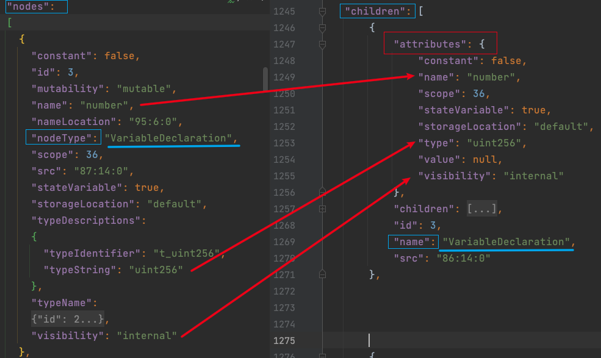
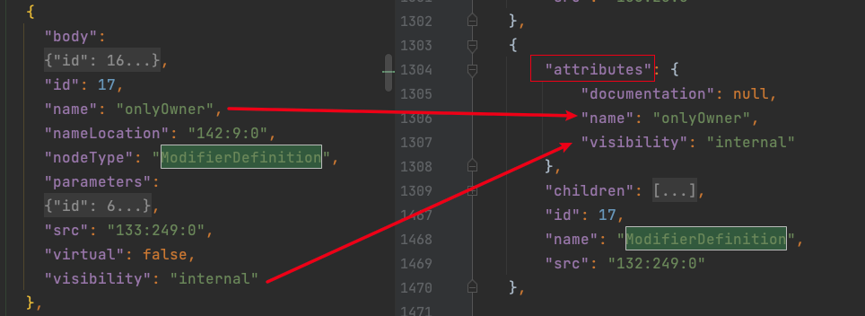
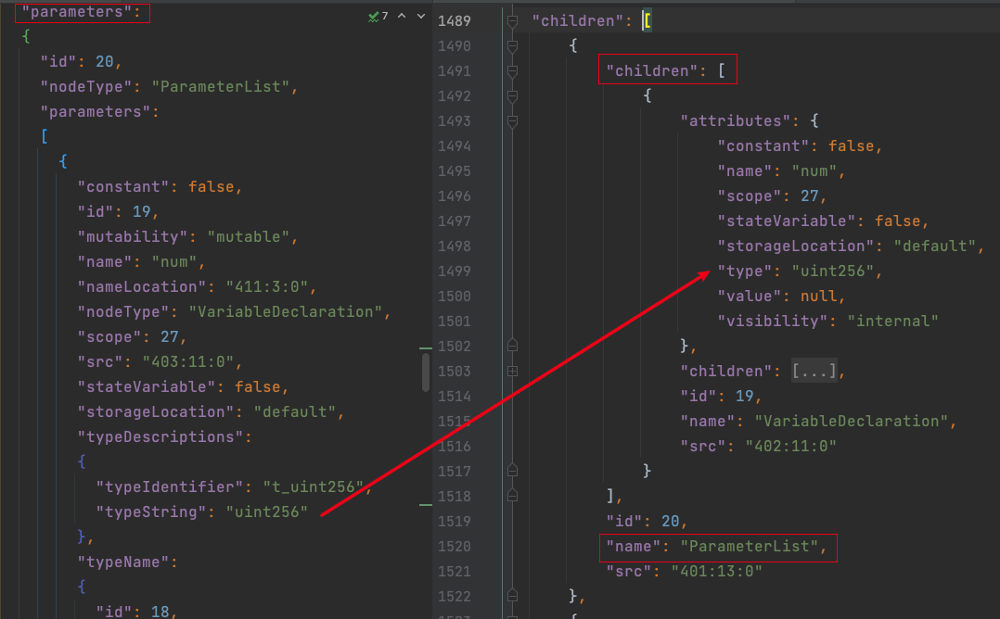
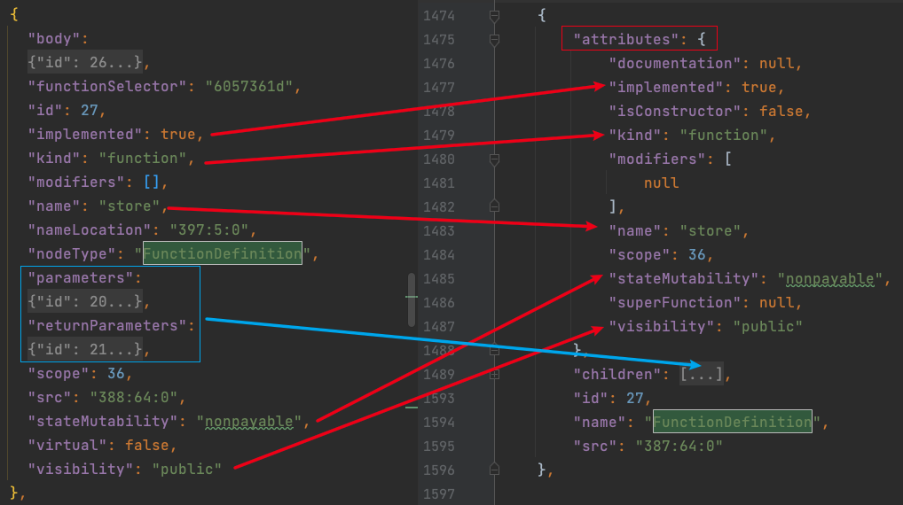

## Solidity Compiler Output JSON Data Structure

#### Get solc output from command line

In our ***solc json parser***, we retrieve relavant information from solidity compiler output. In command line, for version 0.8.17,  we can get information on **abstract syntax tree(ast) and opcodes** by specifying them in solc option `--combined-json` we want in one json file by command:

```bash
solc sol_file_path --pretty-json --combined-json ast opcodes
```

For option `--combined-json`, we have the following fields. 

```
abi,asm,ast,bin,bin-runtime,devdoc,function-debug,function-debug-runtime,generated-sources,generated-sources-runtime,hashes,metadata,opcodes,srcmap,srcmap-runtime,storage-layout,userdoc
```

Different solc version may have different options, you can run `solc --help | grep json` to get some instructions. 

#### Get solc output using python

Since we will be dealing with many different solc versions, we will use will a python library `py-solc-x` to manage them. Here is an example on how to use this library. `out` will contain the information we want.

```python
import solcx
solcx.install_solc('0.8.17')
solcx.set_solc_version('0.8.17')
with open(contract_source_path, 'r') as f:
  	source = f.read()
out=solcx.compile_source(source,output_values=['ast', 'abi','bin'],solc_version='0.8.17')
```

## Solc AST data structure

To explain solc ast data structure better, we will use a simple contract `Storage.sol`as an example.

```solidity
// SPDX-License-Identifier: GPL-3.0
pragma solidity 0.8.17;

contract Storage {
    uint256 number;
    address public owner;
    
    modifier onlyOwner() {
        require(msg.sender == owner, "Not owner");
        _;
    }

    function store(uint256 num) public {
        number = num;
    }

    function retrieve() public view returns (uint256){
        return number;
    }

}
```

From version 0.8.0 and above, some of the keys name changed. Most importantly, `children` becomes `nodes` and `name` becomes `nodeType`. In our code, put them in this way. In the following explanation, we will use `nodeType` and `nodes`for version 0.8.0 and above, and use `name` and `children` for versions below 0.8.0. 

```python
import addict

v_keys = addict.Dict()

v_keys.v8.name = "nodeType"
v_keys.v8.children = "nodes"


v_keys.v5.name = "name"
v_keys.v5.children = "children"

v_keys.v6 = v_keys.v5
v_keys.v7 = v_keys.v5
v_keys.v4 = v_keys.v5
```


### AST data structure after version 0.8.0

The ast output structure of version 0.8.0 and onwards are different, so we need to handle them separately.  

We still use `solcx` to compile the file by `solcx.compile_source(self.source, output_values=['ast'], solc_version=self.exact_version)`, we get structure like this:

```json
{
		"src": "...",
  	"nodes": [...], //(called 'name' in previous version, must be `SourceUnit`)  
    "nodeType": "" // (called 'children' in previous version, must NOT be `None`)    
}
```

The `nodes` or `children` here is the root node for the all contracts' AST in the .sol file. For the this 'root' node, we will a *list of sub-nodes* with nodeType **PragmaDirective(we will skip this because we don't care about it)** or **ContractDefinition(we get info from here)**. If there are more than one contract in one solidity file. The list of sub-nodes will contain multiple with type **ContractDefinition**. So we need to loop the list.

Going into nodes with type **ContractDefinition**(we will use function `_process_contract` to process to node), we will get the following structure which contains some meta-data about a contract. We use function `_get_contract_meta_data` to get the following metadata `contract_id`, `contract_kind`, `is_abstract`, `contract_name`,  `base_contracts`,  `line_number_range`. 

```json
{
    "abstract": false,
    "baseContracts": [],
    "canonicalName": "Storage",
    "contractDependencies": [],
    "contractKind": "contract",
    "fullyImplemented": true,
    "id": 22,
    "linearizedBaseContracts":[22],
    "name": "Storage",
    "nameLocation": "72:7:0",
    "nodeType": "ContractDefinition",
    "nodes": [...], // we will explain about this later 
    "scope": 23,
    "src": "63:197:0",
    "usedErrors": []
}
```

Contracts usually have functions, variables(we call fields) or modifiers. The key `nodes` above contains a **list** of sub-nodes, which can be **FunctionDefinition**, **VariableDeclaration** or **ModifierDefinition**. We will call the list **$L$**.

We first introduce **VariableDefinition**. Looping through **$L$**, if $L_i['nodeType']$ equals "VariableDeclaration". Then $L_i$ is a VariableDefinition Node. Going into this node, we will have the following structure. This is already straightforward and we can get `visibility`, `name`,`line_number_range` here.

```json
{
    "constant": false,
    "id": 3,
    "mutability": "mutable", // mutability
    "name": "number", // variable name
    "nameLocation": "95:6:0",
    "nodeType": "VariableDeclaration",
    "scope": 22,
    "src": "87:14:0", // we can the line number from here
    "stateVariable": true,
    "storageLocation": "default",
    "typeDescriptions": {
        "typeIdentifier": "t_uint256",
        "typeString": "uint256"
     },
    "typeName": {
        "id": 2,
        "name": "uint256",
        "nodeType": "ElementaryTypeName",
        "src": "87:7:0",
        "typeDescriptions": {
            "typeIdentifier": "t_uint256",
            "typeString": "uint256"
        }
    },
    "visibility": "internal"
},
```

**ModifierDefinition** is very simple. Likewise, if if $L_i['nodeType']$ equals "ModifierDefinition". Then $L_i$ is a ModifierDefinition Node. For the moment, we are only interested in getting the **name** and **visibility** of modifiers, which can be easily obtained from the datastructure.

```json
{
    "body": {...} // dict omitted here
    "id": 17,
    "name": "onlyOwner", // name of modifier
    "nameLocation": "142:9:0",
    "nodeType": "ModifierDefinition",
    "parameters":	[...] // list omitted here
    "src": "133:249:0",
    "virtual": false,
    "visibility": "internal" // visibility of modifier
}
```

Next is **FunctionDefinition**. We omit some of the keys here for simplicity. Most of the information can be directly obtained. To get the function signature and return type, we will go into `parameters` and `returnParameters` here. The structure is almost the same and we use function `_get_signature()` to handle both of them. Specifically, we want to get the parameter type, which is under "typeDescriptions"->"typeString" for version 0.8.0 and under "attributes"->"type" for version smaller than 0.8.0, details will be shown later. 

```json
{
    "body": {...}, // omitted here
    "src": "108:64:0", // line numer range
    "stateMutability": "nonpayable", // stateMutability
    "virtual": false, // 
    "visibility": "public", // visibility
    "implemented": true, // if it is abstract
    "kind": "function", // for constructor, 'kind' will be 'constructor' here
    "modifiers": [], // modifier list
    "name": "store", // function name
    "nameLocation": "117:5:0",
    "nodeType": "FunctionDefinition",
		"parameters": {
        "id": 6,
        "nodeType": "ParameterList",
        "parameters": [
            {
             		// a lot of keys are omitted here
                "typeDescriptions": {
                    "typeIdentifier": "t_uint256",
                    "typeString": "uint256" // this is what we want
                },
            		"visibility": "internal"
            }
        ],
        "src": "122:13:0"
		},
    "returnParameters":
    {
        "id": 7,
        "nodeType": "ParameterList",
        "parameters": [],
        "src": "143:0:0"
    },
},
```

### AST data structure before version 0.8.0

The ast output structure of version 0.4.12-0.7.6 are very similar to each other, so they are put into the same catergory. Notice here the `nodes` becomes to `children` and `nodeType` becomes `name`.

```json
{
  	"attributes": {...},
		"children": [...],
  	"id": 23,
    "name": "SourceUnit",
    "src": "37:223:0"
}
```

The children is the root node. Like what we do when processing version greater than 0.8.0, we go into this `children` node, and then into `ContractDefinition`. Different than 0.8.0, for lower versions, the metadata is store in node "attributes", so we need to explicitly go into this node to get information.

```python
    def _get_contract_meta_data(self, node: Dict) -> tuple:
				# ..... omitted some codes ......
        if self.version_key == "v8":
            pass  # do nothing
        else:  # v4, v5, v6, v7
            node = node.get("attributes")
            node["abstract"] = not node.get('fullyImplemented')
```

```json
{
    "attributes": {
        "baseContracts": [null],
        "contractDependencies": [null],
        "contractKind": "contract",
        "documentation": null,
        "fullyImplemented": true,
        "linearizedBaseContracts": [22],
        "name": "Storage",
        "scope": 23
    },
    "children": [...], 
    "id": 22,
    "name": "ContractDefinition",
    "src": "62:197:0"
}
```

As we mentioned before, "children" means "nodes". In "children", we can find **FunctionDefinition**, **VariableDeclaration** or **ModifierDefinition**. 

For **VariableDeclaration**, we need to get some of the information by explicitly going into the "attributes" node. A comparison is shown below. 



For **ModifierDefinition**, we need to get some of the information by explicitly going into the "attributes" node. A comparison is shown below. 



For **FunctionDefinition**, the datastructure is a little different. First, for function signature, for 0.8.0 and above, we can directly get the nodes. But for version lower than 0.8.0, we need to manually get them through looping. For version lower than 0.8.0, input parameters node and return parameters node both have type "ParameterList". The first one is input, the second one is output.

A comparison is shown below. 

```python
# for 0.8.0 and above
parameters = node.get('parameters')
return_type = node.get('returnParameters')

# lower than 0.8.0
for i in range(len(node.get('children'))):
  	if node.get('children')[i].get('name') == "ParameterList":
    		parameters  = node.get('children')[i]
   			return_type = node.get('children')[i+1]
    		break
```


A full sturcture of parameter node is shown below.
```json
"children": [
  {
    "children": [
      {
        "attributes": {
          "constant": false,
          "name": "num",
          "scope": 13,
          "stateVariable": false,
          "storageLocation": "default",
          "type": "uint256",
          "value": null,
          "visibility": "internal"
        },
        "children": [
          {
            "attributes": {
              "name": "uint256",
              "type": "uint256"
            },
            "id": 4,
            "name": "ElementaryTypeName",
            "src": "122:7:0"
          }
        ],
        "id": 5,
        "name": "VariableDeclaration",
        "src": "122:11:0"
      }
    ],
    "id": 6,
    "name": "ParameterList", // first one is input param
    "src": "121:13:0"
  },
  {
    "attributes": {
      "parameters": [
        null
      ]
    },
    "children": [],
    "id": 7,
    "name": "ParameterList", // second one is output param
    "src": "142:0:0"
  },
]
```

Also, the parameter and returnType nodes have different structure than before, so we handle them separately in function `_get_signature()`.

```python
if self.version_key == "v8":
		for param in parameters['parameters']:
				param_type_str += param['typeDescriptions']['typeString'] + ", "
else:  # v4, v5, v6, v7
		for param in parameters['children']:
				param_type_str += param['attributes']['type'] + ", "
```

For metadata of a function, we still need to get some of the information by explicitly going into the "attributes" node. A comparison is shown below. 



## Unicode and Offset

When processing functions, we get the raw code by this. Here the **encode** and **decode** operation are necessary. In python string, the default format is utf-8. In utf-8, © takes two bytes(C2 A9), normal characters such as $ takes one bytes(24) and chinese character 你 takes three bytes(E4 BD A0). The solidity compiler doesn't understand utf-8 and thinks © is two different characters, so if we don't decode it first, the offset is wrong.

```python
raw = self.source.encode()[start: start+offset].decode()
```

## How to extract information with python code
### Extracting Field(Variable) and Modifier
```python
    def _process_modifier(self, node: Dict) -> Modifier:
        if self.version_key == "v8":
            pass
        else:  # v4, v5, v6, v7
            node = node.get("attributes") # pay attention here
        visibility = node.get('visibility')
        name = node.get('name')
        return Modifier(visibility=visibility, name=name)
      
    def _process_field(self, node: Dict) -> Field:
        # omit some code before
        if self.version_key == "v8":
            pass
        else:  # v4, v5, v6, v7
            node = node.get("attributes") # pay attention here
        visibility = node.get('visibility')
        name = node.get('name')
        inherited_from = ""
        return Field(inherited_from=inherited_from, visibility=visibility, 
                     name=name, line_num=line_number_range)

fields = []
modifiers = []
# assume we are already in Contract node.
key_name = 'name'  # if lower than 0.8.0
key_name = 'nodeType' # if higher than 0.8.0
subnodes = contract_node['key_name'] 
for sub_node in subnodes:
  	if sub_node[key_name] == "VariableDeclaration":
      	fields.append(self._process_field(node))
    elif sub_node[key_name] == "ModifierDefinition":
      	modifiers.append(self._process_modifier(node))
    
```
